# Sprint 11R: startup connection evidence and admission policy

## Decision

Retain the existing fail-closed exporter at `f465f29952580e8d060716f80ef4d3b4b73f2ad1`.
Do not enable an ignore/supersession exception. No native implementation or
heartbeat scheduling change is justified by the available connection contract.
This milestone adds regression coverage and records the design/proof boundary;
it does not claim that native startup delivery semantics have been resolved.
Do not request another identical activation.

## Evidence and official semantics

Session `a6b344ee-83ff-46eb-8a72-5100980b549c` emitted HELLO at
`2026-09-20T02:54:00.1895127Z`, entered its callback at `.1955136Z`, wrote the
sidecar at `.1962638Z`, and stopped at `.1970141Z`. Both callback channels were
Disconnected -> Connecting. The same source object, Provider31, reported
Connected for both channels in both immediate samples. The decision was
STOP_CONTRADICTORY_CONNECTION_STATE. There were no heartbeats or candles.
All four original market sessions and the sidecar are retained unchanged.

The installed schedule places that instant on Saturday at 21:54 Chicago time,
outside the weekly session. Market closure explains why candles need not arrive;
it neither explains nor proves the callback/current-state mismatch.

Official references reviewed:

1. [OnConnectionStatusUpdate](https://docs.ninjatrader.com/ninjascript/onconnectionstatusupdate):
   connection changes invoke this callback; price-feed state and adapter/order
   state are distinct. No startup drain or delivery-order guarantee is stated.
2. [ConnectionStatusEventArgs](https://docs.ninjatrader.com/ninjascript/connectionstatuseventargs):
   previous/new event states and the associated Connection are available. Its
   example cautions about multithreading and retaining the event before async UI
   work. It supplies no generation identifier or event-creation timestamp.
3. [Connection](https://docs.ninjatrader.com/ninjascript/connection_class):
   the object exposes price and adapter states, including Connecting, Connected,
   Disconnected, Disconnecting and ConnectionLost. These are API states, not a
   certificate of physical network health or permission to ignore a callback.
4. [Multi-threading considerations](https://ninjatrader.com/support/helpGuides/nt8/multi-threading.htm):
   core objects can be ahead of delivered event parameters in the documented
   **order** example. Its explicit sequence guarantees concern order events.
   Applying them to connection startup would be an inference, not a documented
   connection guarantee. Async dispatcher use is recommended over synchronous
   invocation that can deadlock during script loading.

The installed NinjaTrader.Core XML repeats the connection-change definition and
does not add startup replay, event/object versioning or atomic-read semantics.
Successful compilation verifies available member types, not delivery ordering.
No unverified forum statement is used as authority for a safety exception.

The observed tuple is compatible with a superseded transition. It cannot
distinguish that hypothesis from another generation/change not yet delivered,
an inconsistent snapshot, or a provider/native publication issue. Same identity
is not a connection-generation proof. Two matching reads can miss a change and
return between samples. UTC callback-entry time is not the event-creation time.
We therefore label it SUPERSESSION_CANDIDATE, never SUPERSESSION_PROVEN.

## Smallest deterministic admission model

The existing implementation has three effective admission states; this is a
description of its writer/fail-latch behavior, not a new runtime authority:

```mermaid
stateDiagram-v2
    [*] --> DORMANT
    DORMANT --> ACTIVE: Realtime metadata and SafeSource pass; HELLO
    DORMANT --> STOPPED: startup failure or termination
    ACTIVE --> ACTIVE: accepted observation or validated heartbeat
    ACTIVE --> STOPPED: unsafe/unknown observation, failure or termination
    STOPPED --> STOPPED: any later callback or queued timer action
```

DORMANT callbacks cannot admit data. ACTIVE means a stream exists, not that
native continuity or account eligibility has been certified. STOPPED is terminal
for that indicator instance. There is no automatic recovery or retry.

Observation classification is separate from admission state:

| Class | Objective observation | Current action |
| --- | --- | --- |
| A: current disconnection | Current price sample Disconnected, Disconnecting or ConnectionLost | STOP; physical cause remains unproven |
| B: connection in progress | Current price sample Connecting | STOP/no admission; do not relabel it a proven physical outage |
| C: candidate superseded startup | Previous Disconnected, callback Connecting, same provider/object, both current channels stably Connected | STOP as contradiction; cannot promote candidate to proven supersession |
| D: contradictory/unstable | Event/current mismatch or changing current samples | STOP |
| E: observed connected agreement | Known same identity/provider; both current price samples Connected; event/current channels agree | CONTINUE; no account/order authority |
| F: unknown | Null event/source/options, unknown enum or unreadable state | STOP |

Current non-connected price samples veto first. The existing stop category
STOP_CONFIRMED_PRICE_CONNECTION_LOST also covers Connecting; the recorded enum
distinguishes A from B. The label must not be interpreted as a physical outage.
Foreign objects and provider mismatches stop. Adapter status may be consistently
Disconnected while price status is Connected; that can support market data but
never grants order authority. Conflicting adapter observations stop.

A future implementation could add a non-admitting startup observation state,
but must not promote it by elapsed time, repetition, double reads or missing
ticks. Promotion needs an established connection-specific ordering/generation
contract and positive current-source evidence. That design is not activated.

## Sampling and heartbeat scheduling

Scalar event values are captured synchronously under the indicator lock; source
state is sampled twice. This lock does not serialize NinjaTrader's connection
internals. The policy does not claim an atomic provider snapshot or immunity to
changes immediately after a read. Subsequent callbacks and every heartbeat/bar
validation retain their veto; reader freshness remains independently enforced.

Currently Realtime validates SafeSource and queues timer creation with
InvokeAsync. The queued action takes the same lock and rechecks the fail latch
and writer before creating the five-second timer. Each tick checks SafeSource
before writing HEARTBEAT. No tick/candle is required for that validation.

Deterministic tests execute the actual OnStateChange, Heartbeat and Stop methods:

- Stop or termination before dispatch: the queued action creates no timer.
- Timer starts before stop: cleanup disables it and later ticks emit nothing.
- Source becomes unhealthy before dispatch: a timer may be created, but its
  first validation fails; zero heartbeats are emitted.
- Stable health with no bar callbacks: four manual ticks emit four heartbeats
  and no candles; termination closes both writers.
- Failed startup: no stream or timer is created.

Thus timer *creation* is not currently a post-callback-adjudication guarantee.
If a future proven state machine requires that guarantee, both enqueue and
dispatch must require the same admitted state/generation under the lock, with
revalidation before emission. Moving scheduling behind an unproven startup
callback would not solve ordering and could wait indefinitely. No such change,
sleep, retry or timer redesign is made in this milestone.

## Closed-market contract and deterministic tests

The native method harness has no fabricated market events. Its controlled ticks
test logic only; they do not represent fifteen seconds of native elapsed time.
A separate reader test initializes an explicit synthetic Saturday clock before
constructing the reader, confirms the calendar is closed, then delivers four
fresh heartbeats at five-second intervals. At twenty simulated seconds transport
is connected, canonical candles remain zero, the PAPER runtime is uncreated and
all execution authority remains disabled. Disconnect still latches immediately
even during market closure. No captured native evidence is replayed into runtime.

The callback matrix includes Disconnected -> Connecting -> Connected,
Connecting -> Connected, exact observed startup values, Connected -> Connecting
with current Connected, Connected -> Disconnected/ConnectionLost, agreements,
disagreements, rapid ordered/superseded candidates, identity/provider mismatch,
unstable samples and null/unknown states. An unsafe event during ACTIVE latches;
later Connected events cannot undo it. These tests prove the conservative policy,
not that a superseded callback is safe to ignore.

## Evidence required before another native experiment

An identical exporter stops at the first mismatch and suppresses later callbacks.
Another identical activation cannot establish the missing ordering. Before a
new activation, obtain either:

1. Version-specific official/native contract evidence establishing how indicator
   startup callbacks are initialized/queued, their ordering relative to current
   Connection properties, and whether a connection generation can be identified;
   or
2. A separately reviewed **observation-only** diagnostic that records the full
   startup sequence (including before ACTIVE and after market admission stops),
   with bounded capture, monotonic observation indices, script lifecycle stage,
   safe provider enum, same-source/generation evidence where the API supports it,
   callback previous/new states and contemporaneous current samples. Correlate
   the global connection event and indicator callback if supported, without
   account enumeration, network commands or revival of market admission.

The second experiment must distinguish a delayed initial transition followed by
Connected from an ongoing transition, identity/generation change or unstable
source. A later Connected callback is useful evidence, not by itself permission
to ignore earlier unsafe events. Provider event-origin time or an ordering
guarantee is still needed for claims of proven supersession. NativeError and
private names must remain excluded. That observer is specified here, not built
or deployed; no native retest is requested.

## Status

Native closed-market heartbeat continuity remains uncertified. Closed 1m and HTF
certification remain pending market open and healthy transport. SIM discovery,
SIM order authority and LIVE authority remain blocked/disabled. Thresholds
90 / 80.5 / 85 and all strategy/risk behavior remain unchanged. This is a local
test/research preservation milestone, not a provider integration pass.
